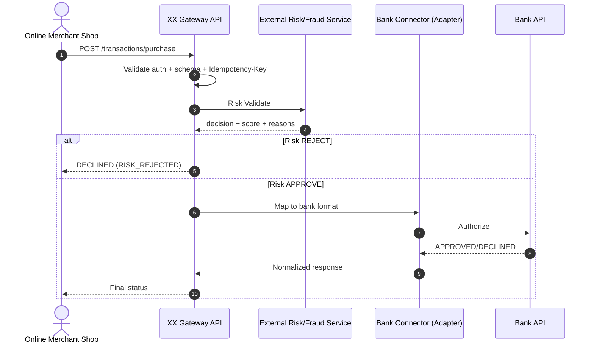
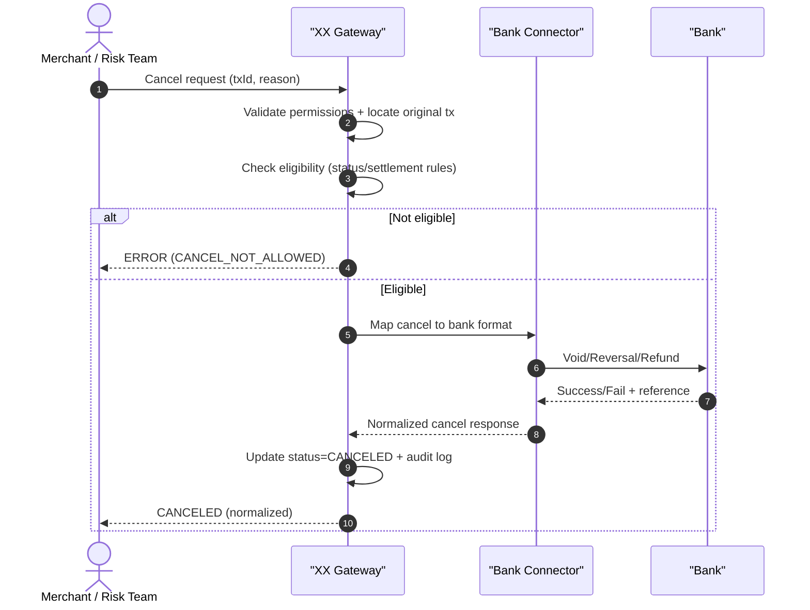
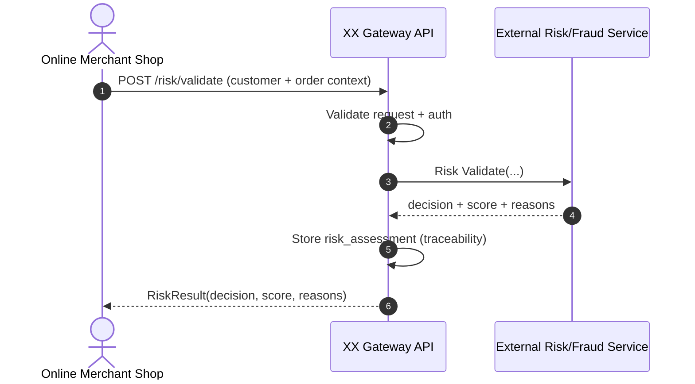

## (XX Gateway)
## Purchase Flow 

```mermaid
sequenceDiagram
autonumber
actor Merchant as Online Merchant Shop
participant GW as XX Gateway API
participant Risk as External Risk/Fraud Service
participant BC as Bank Connector (Adapter)
participant Bank as Bank API

Merchant->>GW: POST /transactions/purchase
GW->>GW: Validate auth + schema + Idempotency-Key
GW->>Risk: Risk Validate
Risk-->>GW: decision + score + reasons

alt Risk REJECT
  GW-->>Merchant: DECLINED (RISK_REJECTED)
else Risk APPROVE
  GW->>BC: Map to bank format
  BC->>Bank: Authorize
  Bank-->>BC: APPROVED/DECLINED
  BC-->>GW: Normalized response
  GW-->>Merchant: Final status
end
```
## Cancellation Flow

```mermaid
sequenceDiagram
autonumber
actor RM as Merchant / Risk Team
participant GW as "XX Gateway"
participant BC as "Bank Connector"
participant BK as "Bank"

RM->>GW: Cancel request (txId, reason)
GW->>GW: Validate permissions + locate original tx
GW->>GW: Check eligibility (status/settlement rules)

alt Not eligible
  GW-->>RM: ERROR (CANCEL_NOT_ALLOWED)
else Eligible
  GW->>BC: Map cancel to bank format
  BC->>BK: Void/Reversal/Refund
  BK-->>BC: Success/Fail + reference
  BC-->>GW: Normalized cancel response
  GW->>GW: Update status=CANCELED + audit log
  GW-->>RM: CANCELED (normalized)
end
```
## Standalone Risk Validation

```mermaid
sequenceDiagram
autonumber
actor Merchant as Online Merchant Shop
participant GW as XX Gateway API
participant Risk as External Risk/Fraud Service

Merchant->>GW: POST /risk/validate (customer + order context)
GW->>GW: Validate request + auth
GW->>Risk: Risk Validate(...)
Risk-->>GW: decision + score + reasons
GW->>GW: Store risk_assessment (traceability)
GW-->>Merchant: RiskResult(decision, score, reasons)
```

