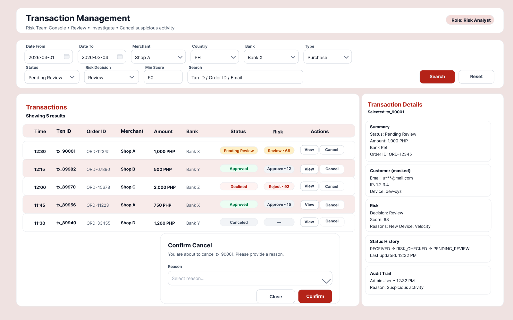

# Risk Team Console (Transaction Management)

**Disclaimer:** Vendor-neutral portfolio artifact. No proprietary or confidential company information included.

## Wireframe

A vendor-neutral wireframe/spec for an internal console that allows Risk/Ops teams to review transactions and perform controlled cancellations with audit trail.

## Screen layout
- Top filters/search
- Main table (transactions list)
- Right-side details panel (investigation view)
- Cancel confirmation modal (reason required)

## Filters (examples)
- Date range, Merchant, Country, Bank
- Transaction type (Purchase/Cancellation/Risk Check)
- Status (Approved/Declined/Pending Review/Canceled/Error)
- Risk decision + minimum risk score
- Search by Transaction ID / External Order ID

## Table columns
- Time
- Transaction ID
- Order ID
- Merchant
- Amount/Currency
- Bank
- Status
- Risk (score/decision)
- Actions

## Actions
- **View**: opens the details panel
- **Cancel**: only if eligible + user has permission
- Optional: **Mark Reviewed** / add note

## Details panel
- Summary (status, amount, references)
- Customer context (masked/minimal)
- Risk (decision, score, reasons)
- Status history timeline
- Audit trail of manual actions (who/when/why)

## Control requirements (security/ops)
- RBAC enforced server-side for cancel action
- Cancel requires confirmation + mandatory reason
- Cancellation eligibility enforced by status/state rules (e.g., not after settlement/final state)
- All actions write to audit trail + status history (including failed cancel attempts)
- Sensitive data is masked; no PAN/secret tokens displayed or logged (tokenized references only)
